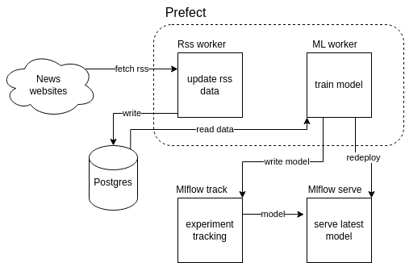

# rss-store

System for gathering rss feed entries and training/serving ML classification model. The model takes as input text sample and predicts from which source does it come from.

Written using Python ([prefect](https://github.com/PrefectHQ/prefect), [mlflow](https://github.com/mlflow/mlflow)) and PostgreSQL.

## Architecture

The system continuously updates data source, retrains model on fresh data and redeploys prediction service once new model becomes available.



## Instructions

1. Build agent images

```
# from ./rssagent
docker build . -t rssagent:latest

# from ./mlagent
docker build . -t mlagent:latest
```

2. Create volumes

```
mkdir postgres
mkdir mlflow
mkdir mlflow/{artifacts,runs}
```

3. Run

```
docker-compose up -d
```

4. Add rss sources into postgres instance

Connect to postgres instance (`rss` db) and update `source` table.

Sample query in [sample_rss.sql](sample_rss.sql).

5. Trigger tasks

Need to be run from one of the prefect worker containers (`rssagent` / `mlagent`)

```
prefect deploy --prefect-file /flows/prefect.yaml
```

## Exposed services

| Service | link |
| --- | --- |
| Prefect dashboard | http://localhost:4200/dashboard |
| mlflow dashboard | http://localhost:8080 |
| ml flow predict API | http://localhost:5000 |

Makaing prediction against latest model:

```
curl http://127.0.0.1:5000/invocations -H 'Content-Type: application/json' -d '{"inputs": ["test tekst 1", "test tekst 2"]}'
```
